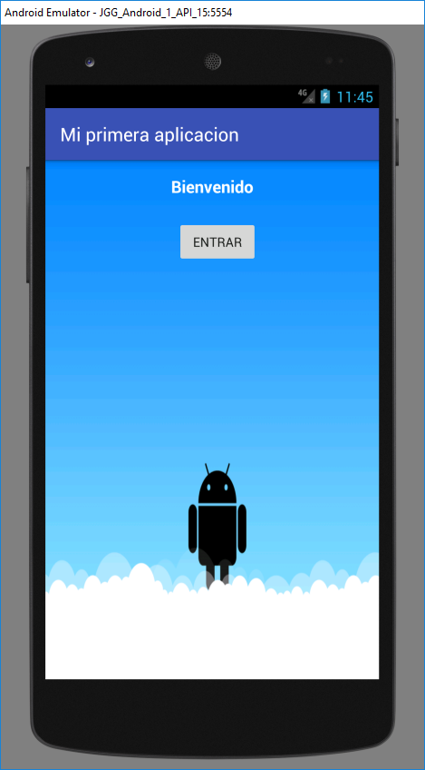
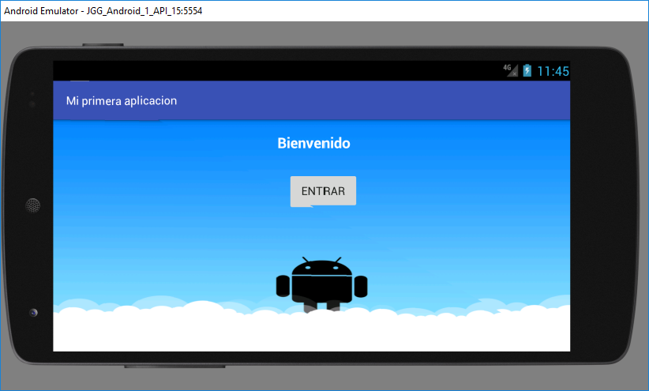
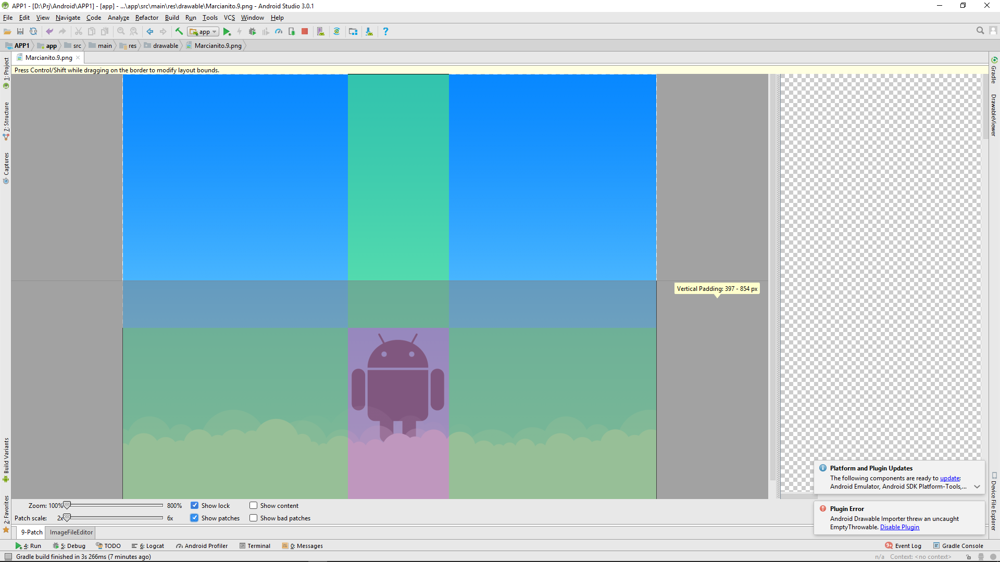
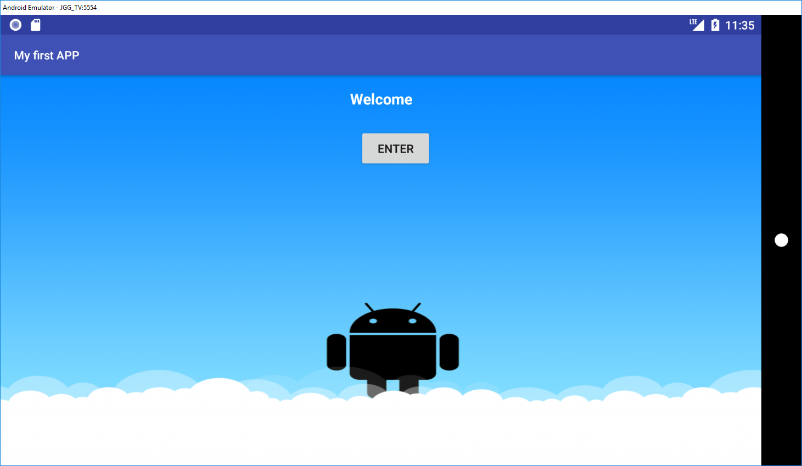
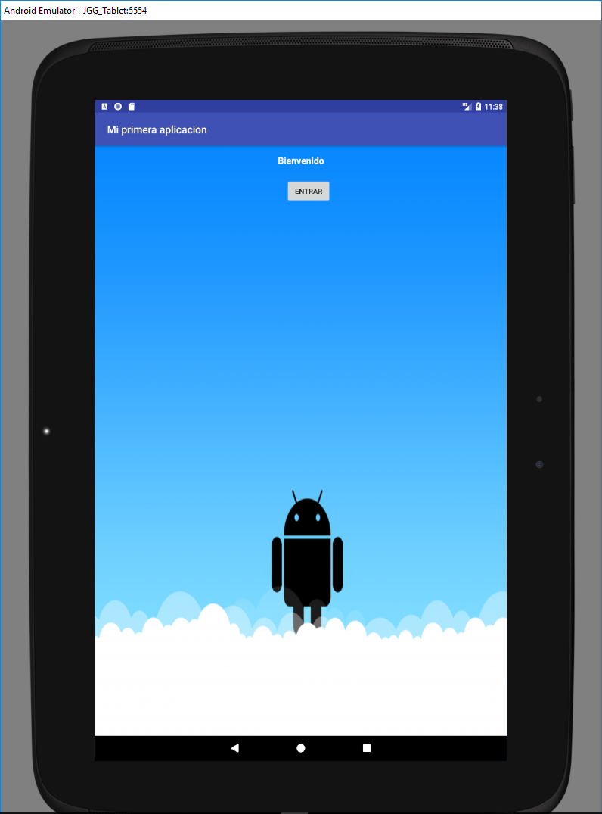

#Ejemplo del resultado del primer proyecto Android

1.  **Idiomas**

| [./media/image1.png](./media/image1.png) |   | [./media/image2.png](./media/image2.png) |
|------------------------------------------|---|------------------------------------------|
|                                          |   |                                          |
| [./media/image3.png](./media/image3.png) |   | [./media/image4.png](./media/image4.png) |

2.  **Soporte tamaños de pantalla y orientación**

1.  **Imagen para Fondo y muestra de nine patch**

